# 🤖 Telebot

A modular, production-ready Telegram bot built with `python-telegram-bot` and `SQLAlchemy`.

Automatically replies to frequently asked questions in Telegram groups, reducing repetitive conversations and saving time.

[](https://www.python.org/)
[](https://telegram.org/)

---

## 🚀 Features

- ✅ Auto-reply to repeated questions  
- ⚡ Fast and efficient response system  
- 🏗️ Modular architecture (easy to extend)  
- 👥 Group chat support  
- 🗄️ Database integration (SQLite + SQLAlchemy)  
- 🤖 AI-based smart replies *(planned)*  
- 📊 Admin dashboard *(planned)*  

---

## 🛠️ Tech Stack

| Technology | Purpose |
|------------|---------|
| Python | Core language |
| python-telegram-bot | Telegram API |
| SQLAlchemy | ORM |
| SQLite | Database |
| Railway | Deployment |

---

## 🎬 Bot in Action

| Chat Examples | |
|---------------|-|
| 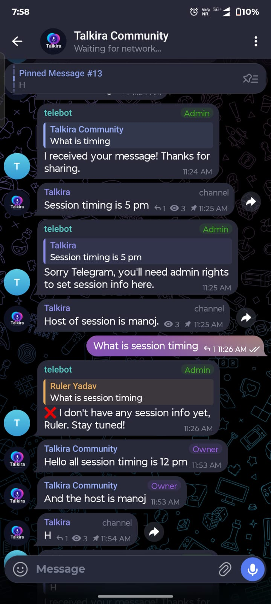 | 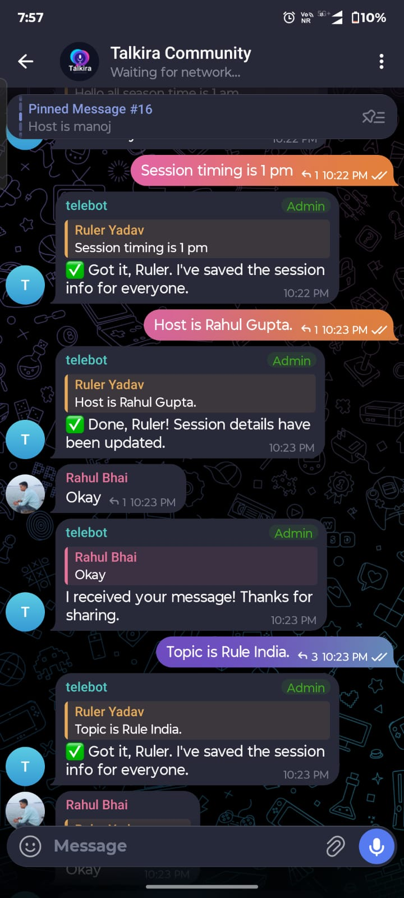 |
| 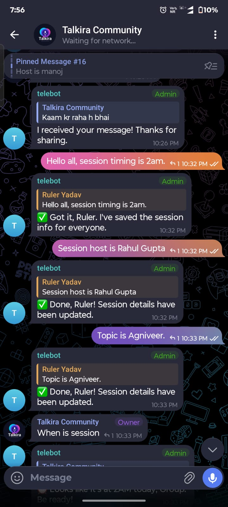 | 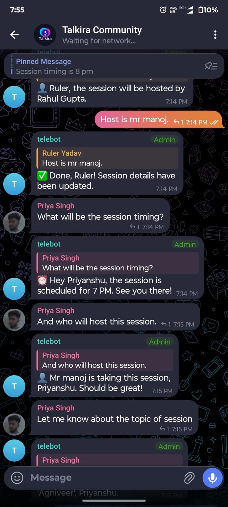 |
| 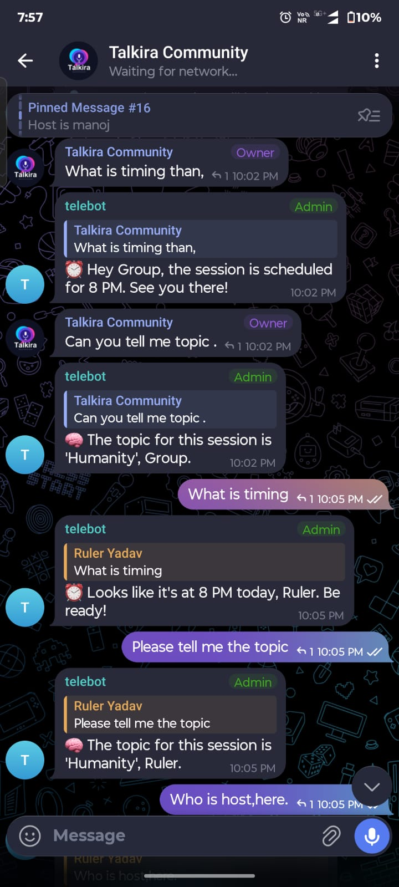 | 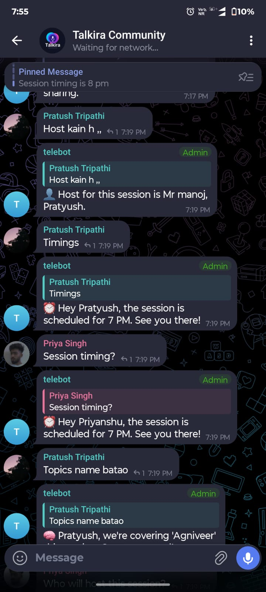 |
| 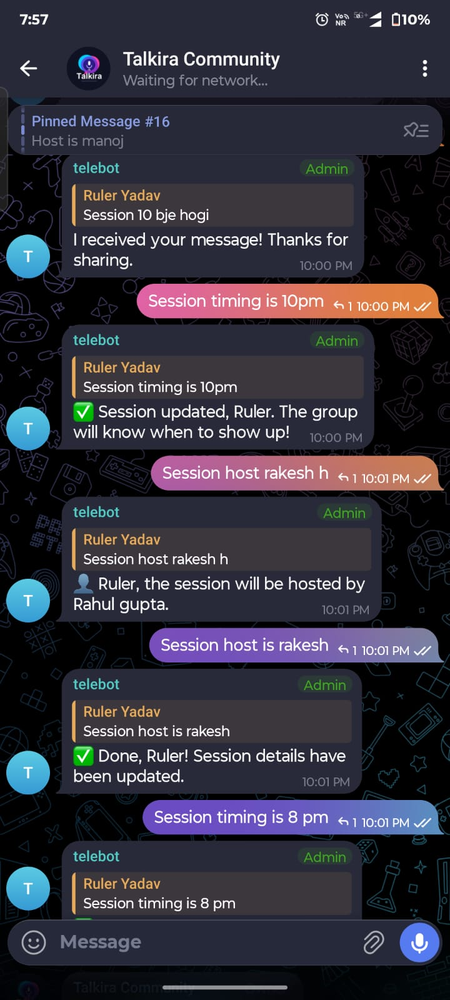 | 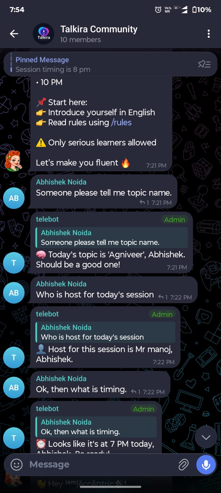 |
| 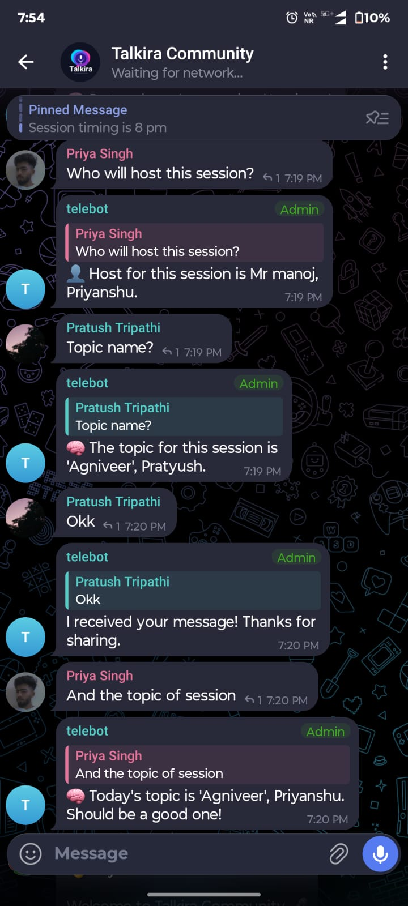 |  |
| 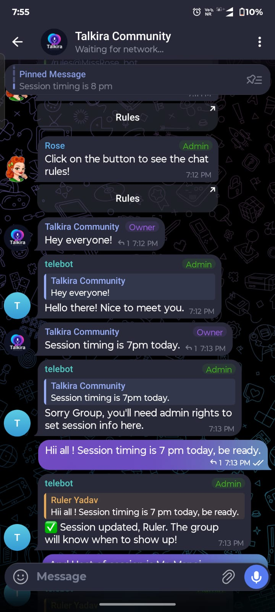 | 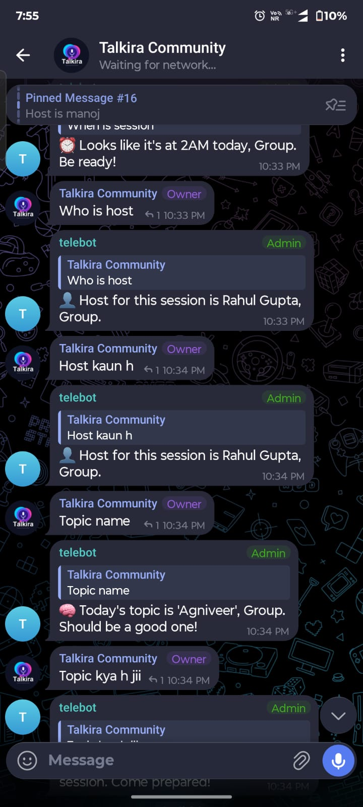 |
| 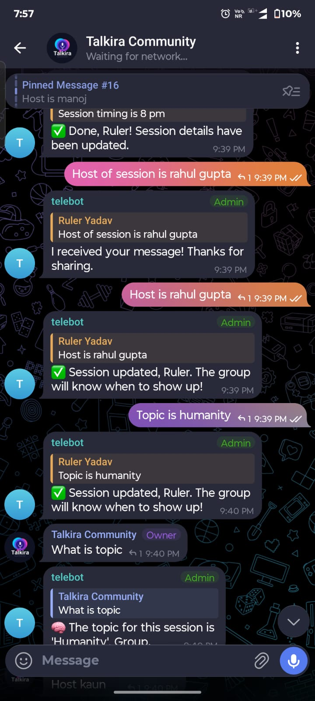 | |

---

## 💬 User Feedback

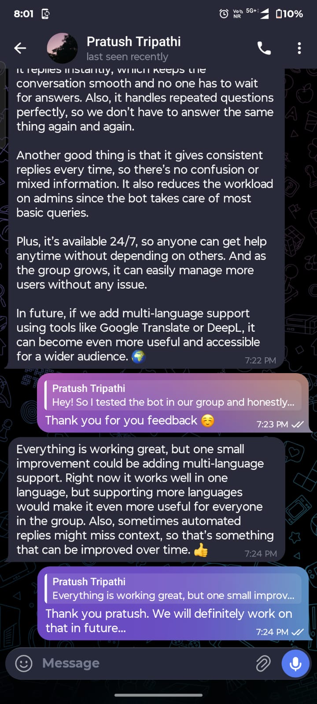  
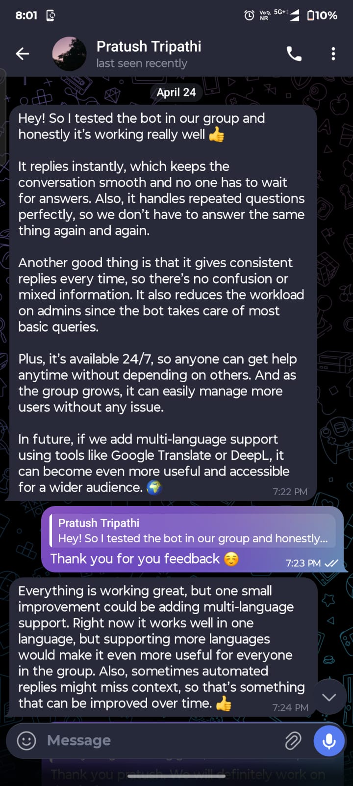
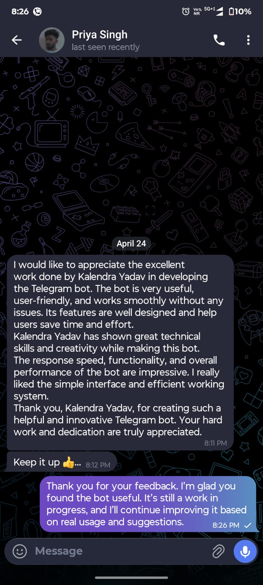  

---

---
## 🚀 Deployment (Railway)

The bot is successfully deployed on Railway and runs continuously to handle real-time Telegram group interactions.

It is configured with environment variables and connected to a persistent SQLite database for stable performance.

### 📸 Deployment Screenshots

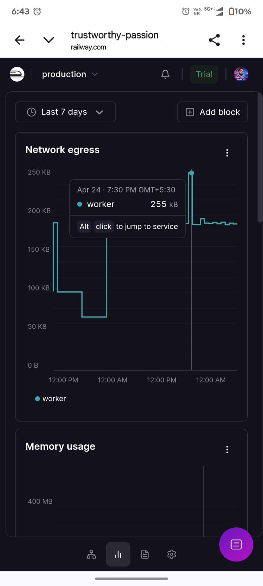  
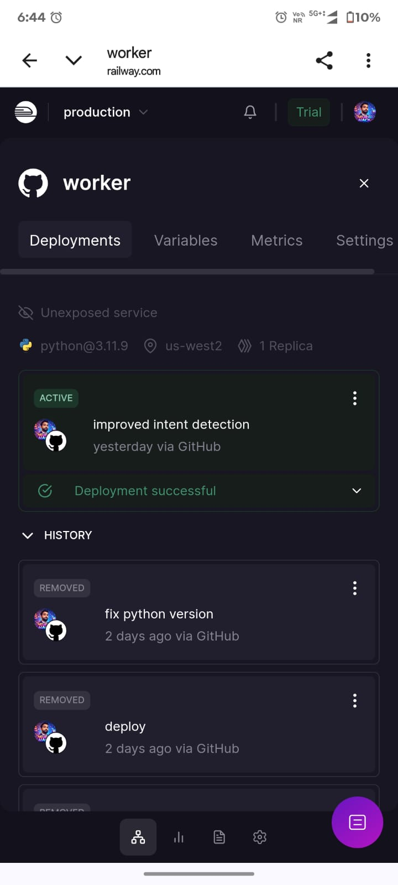

#deployment #telegrambot #python #automation #railway

## ⚙️ Quick Setup

### 1. Clone & Install
```bash
git clone https://github.com/KalendraYadav/telebot.git
cd telebot
pip install -r requirements.txt